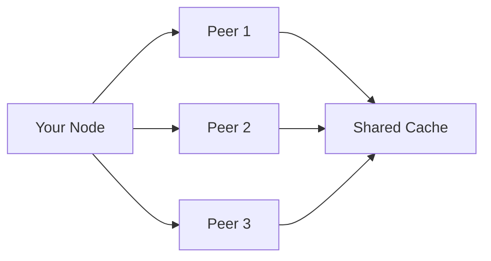

# 🌾 Harvest — The Web Data Layer for AI Agents

<p align="center">
  <em>Scrape → P2P Cache → Semantic Search → Agent Memory</em><br>
  <strong>Your AI agent's persistent brain for web data.</strong>
</p>

<p align="center">
  <a href="https://github.com/zad111ak-ai/harvest"></a>
  <a href="https://pypi.org/project/harvest-agent/"></a>
  <a href="https://github.com/zad111ak-ai/harvest/actions"></a>
  
  <a href="LICENSE"></a>
  <a href="https://github.com/sponsors/zad111ak-ai"></a>
</p>

---

## 🤔 What is Harvest?

Harvest is a **web scraping toolkit designed for AI agents**. It's not just another crawler — it's the **data layer** between the web and your AI agent's brain.

**The problem:** AI agents forget everything between sessions. You research a topic for 3 hours, find critical data, and tomorrow the agent has no memory of it.

**The solution:** Scrape → Store in semantic memory → Agent remembers forever.

### How It's Different

| | Traditional Scrapers | Harvest |
|---|---|---|
| **Scrape** | ✅ | ✅ |
| **P2P Cache Sharing** | ❌ | ✅ BitTorrent for web data |
| **Semantic Memory** | ❌ | ✅ DenseForge integration |
| **MCP Protocol** | ❌ | ✅ Works with any MCP agent |
| **Agent Integration** | Manual | Automatic |

### Key Features

- **🕷️ Smart Scraping** — handles JavaScript, anti-bot, CAPTCHAs
- **🌐 P2P Network** — share cache with other scrapers (50-90% query savings)
- **🧠 Semantic Memory** — integrates with DenseForge for persistent agent memory
- **🔌 MCP Protocol** — 17 tools for AI agents
- **📊 Analytics** — track scraping success, costs, and performance
- **⚡ Dual Backend** — Scrapling (lightweight) or Crawl4AI (73K+ ⭐, production-grade)

## 🚀 Quick Start

```bash
pip install harvest-agent
```

**With Crawl4AI backend** (production-grade anti-bot + deep crawl):
```bash
pip install harvest-agent[crawl4ai]
```

```python
from harvest import Harvest, CrawlConfig

harvest = Harvest()

# Simple scrape
result = await harvest.scrape("https://example.com")

# Scrape with AI extraction
data = await harvest.scrape(
    "https://news.example.com",
    prompt="Extract all article titles and summaries"
)

# Start P2P network
config = CrawlConfig(p2p_enabled=True)
harvest = Harvest(config)
await harvest.start()
```

### MCP Server

```bash
# Add to your MCP agent config
{
  "harvest": {
    "command": "harvest-mcp",
    "env": {
      "HARVEST_API_KEY": "your-key"
    }
  }
}
```

## 📦 Architecture

```
harvest/
├── core.py           # Main Harvest class
├── cache.py          # Local cache (SQLite)
├── p2p/              # P2P network layer
│   ├── node.py       # WebSocket peer
│   ├── error_handler.py
│   └── bootstrap_server.py
├── p2p_network.py    # P2P cache network
├── security.py       # SSRF protection, auth
├── mcp_server.py     # MCP protocol server
└── integrations/
    └── denseforge.py # DenseForge bridge
```

## 🌐 P2P Network

Harvest uses a **decentralized cache network**. Each node = client + server. When you scrape a page, the result is shared with peers. When you need data, check the network first.



**Benefits:**
- 50-90% fewer API calls
- Faster responses (cache hits)
- No central point of failure
- Privacy-first (selective sharing)

## 🔌 MCP Tools

| Tool | Description |
|------|-------------|
| `harvest_scrape` | Scrape a URL |
| `harvest_extract` | Extract structured data |
| `harvest_crawl` | Crawl multiple pages |
| `harvest_contacts` | Extract contact info |
| `harvest_batch` | Batch scrape multiple URLs |
| `denseforge_search` | Search semantic memory |
| `denseforge_ingest` | Store data in memory |
| `denseforge_ask_why` | Ask why something happened |
| `denseforge_stats` | Get memory statistics |

## 🧪 Testing

```bash
# Run all tests
pytest tests/

# Run specific test suite
pytest tests/test_p2p.py      # 43 tests
pytest tests/test_security.py # 29 tests
```

**Test Coverage:** 72 tests across P2P, security, and cache modules.

## 🤝 Contributing

We're building the **future of AI agent data**. Join us!

### Areas for Help
- 🐛 Bug fixes
- 📝 Documentation
- 🧪 Tests
- 🌐 P2P protocol improvements
- 🔌 New integrations

### Development
```bash
git clone https://github.com/zad111ak-ai/harvest
cd harvest
pip install -e ".[dev]"
pytest tests/
```

---

## 📜 License

MIT License — use it however you want.

---

## ❤️ Support This Project

If Harvest saves you time or money, consider supporting development:

<p align="center">
  <a href="https://github.com/sponsors/zad111ak-ai"></a>
</p>

### 🪙 Crypto Donations

| Currency | Address |
|----------|---------|
| **BTC** | `bc1qd8sa7e4f696wmcyszuxh9snqt2n66zrhz9g80j` |
| **ETH** | `0xD26f0efE6A8F11e127c3Af3D6163BD458a1693c3` |
| **USDT (TON)** | `UQAoI2i8P9-JeZhvGSUwKnymVyY5cb-1Rg7pdqoWMNena7DP` |
| **SOL** | `99EtqBVTeF5UNp9a1oPi18iVXbXptTG7YQ6JeJvXMUJK` |

<p align="center">
  <em>Every donation helps build better tools for AI agents! 🙏</em>
</p>

---

<p align="center">
  <strong>🌾 Harvest — Your AI agent never forgets.</strong>
</p>
