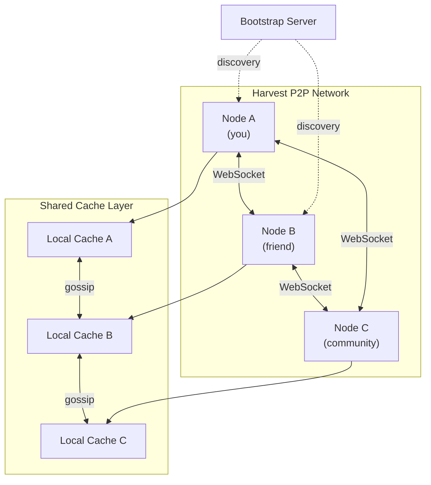
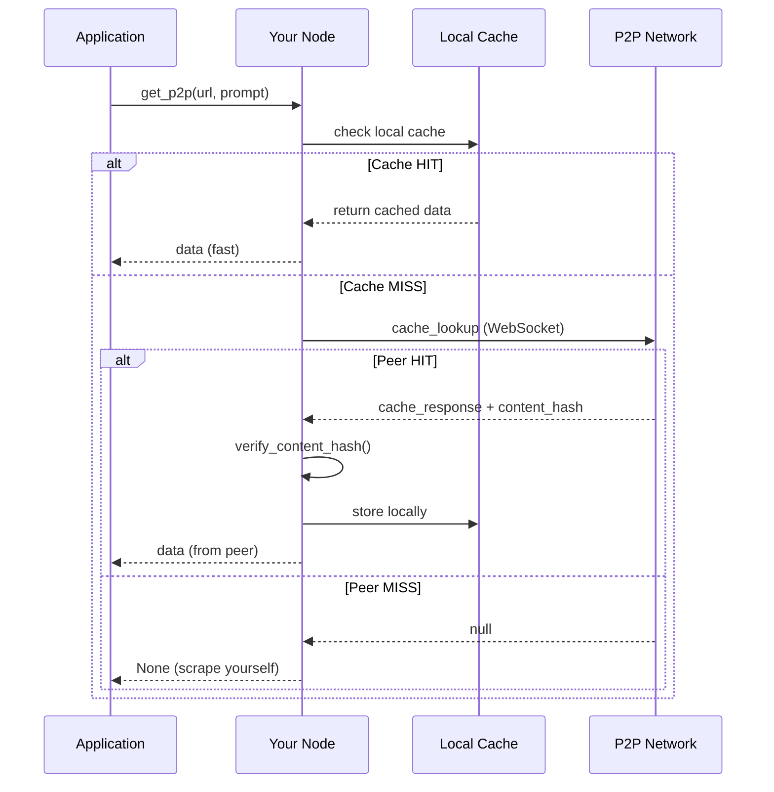
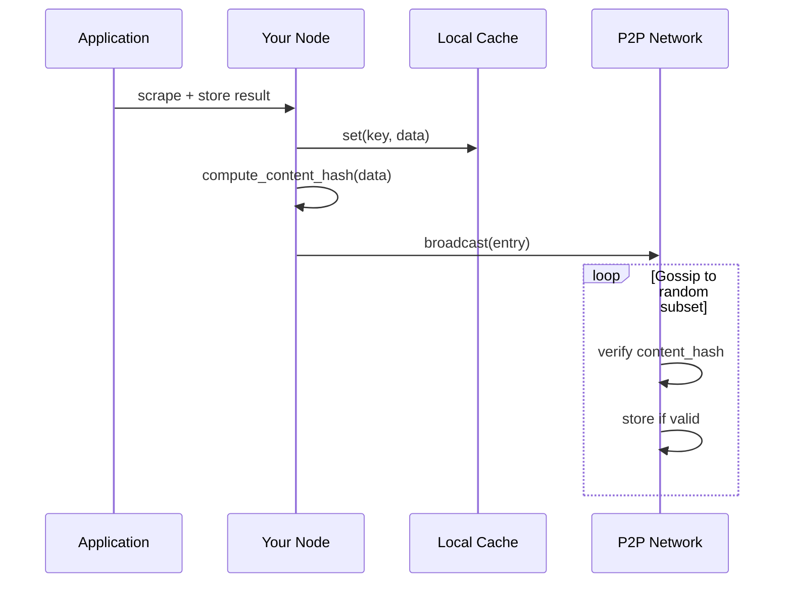
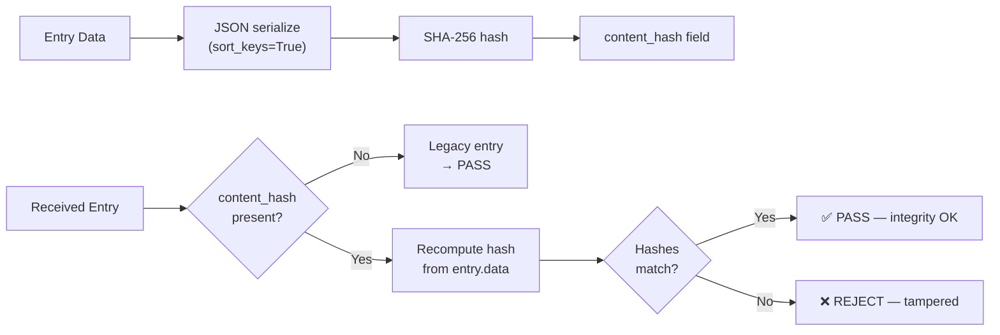
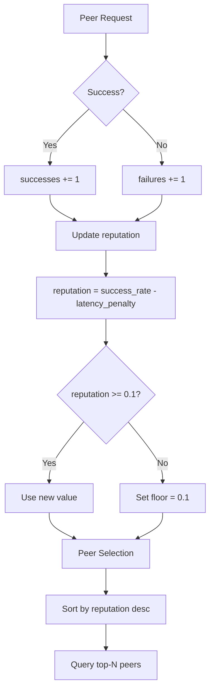
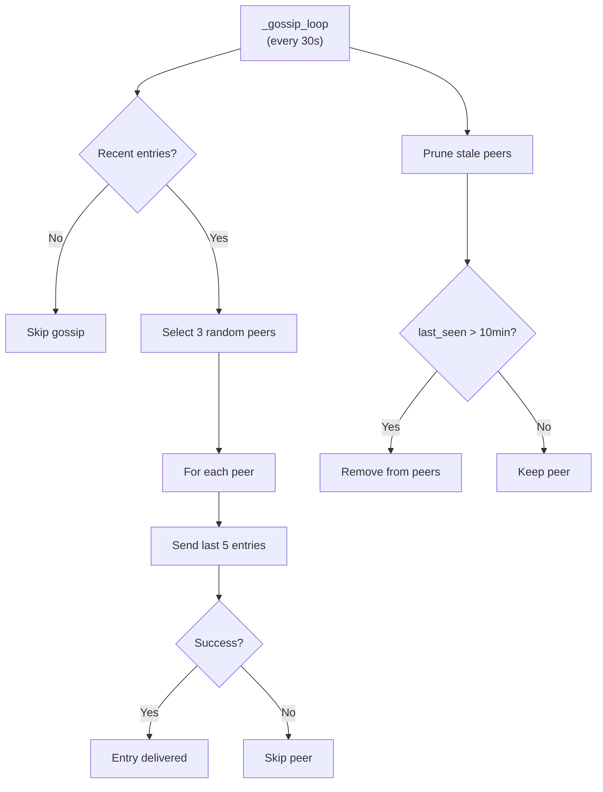
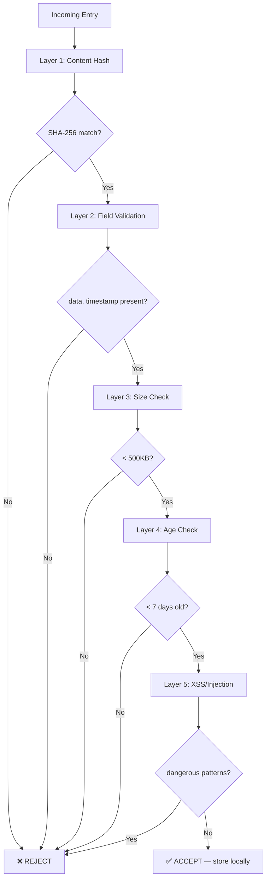
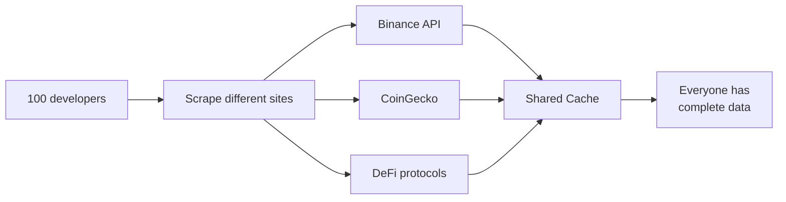
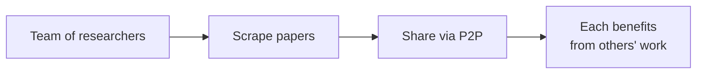
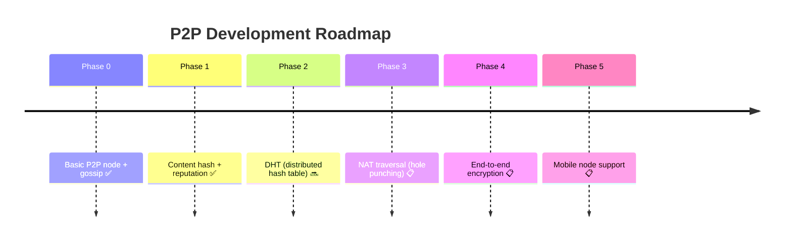

# Harvest P2P Network — Architecture & Design

## Vision

Harvest P2P is a **decentralized cache-sharing network** for web data. Think BitTorrent for scraped content — every node contributes and benefits.

**The problem it solves:** Individual scrapers have limited reach. One person can't scrape everything. But a network of 100 people each scraping different sources creates a collective intelligence that outperforms any single cloud API.

## Network Topology



## Request Flow



## Data Flow — Cache Broadcast



## Content Hash Verification



## Peer Reputation System



## Gossip Protocol



## Protocol Messages

| Message | Direction | Payload | Purpose |
|---------|-----------|---------|---------|
| `hello` | Client→Server | `{peer_id, address}` | Initial handshake |
| `hello_ack` | Server→Client | `{peer_id, address, known_peers[]}` | Accept + share peers |
| `cache_lookup` | Client→Server | `{key}` | Request cache entry |
| `cache_response` | Server→Client | `{key, data, peer_id}` | Return cached data |
| `cache_update` | Broadcast | `{entry, source}` | Share new entry |
| `ping` | Either | `{}` | Keep-alive |
| `pong` | Either | `{}` | Keep-alive response |

## Security Layers



## Use Cases

### Community Data Pool



### Research Collaboration



## Configuration

```python
from harvest.p2p.node import P2PNode, P2PConfig

config = P2PConfig(
    listen_port=8765,
    bootstrap_servers=["ws://bootstrap.harvest.network:8765"],
    max_peers=50,
    cache_ttl=3600,  # 1 hour
    share_level="public",  # or "private", "selective"
)

node = P2PNode(config)
await node.start()
```

## Privacy & Security

| Concern | Solution |
|---------|----------|
| **Data leakage** | Selective sharing — control what you share |
| **Malicious nodes** | Content hash verification |
| **MITM attacks** | WebSocket encryption (wss://) |
| **Spam** | Rate limiting per peer |
| **Tracking** | Optional anonymous mode |

## Roadmap



## File Structure

```
harvest/p2p/
├── __init__.py          # Module exports
├── node.py              # P2PNode, PeerInfo, P2PConfig
├── error_handler.py     # Error tracking + auto-disable
└── bootstrap_server.py  # Bootstrap/discovery logic

harvest/
├── p2p_network.py       # P2PCacheNetwork (high-level API)
└── cache.py             # ResponseCache (local cache)
```

## Contributing

The P2P module needs community help:
- **NAT traversal** — hole punching for behind-firewall nodes
- **Encryption** — end-to-end encryption for shared data
- **Reputation** — trust scoring for peers
- **Mobile** — lightweight node for mobile devices

See [CONTRIBUTING.md](../CONTRIBUTING.md) for guidelines.

---

**Join the network. Share your cache. Build collective intelligence.**
