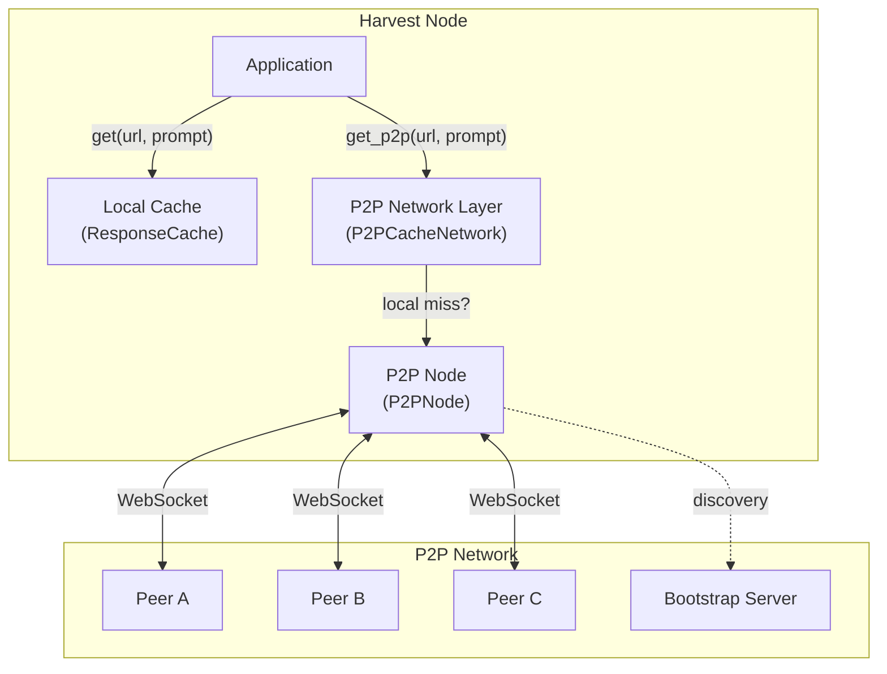
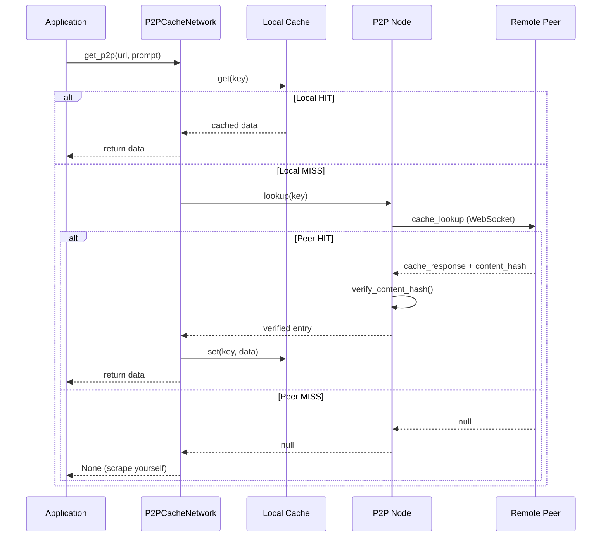
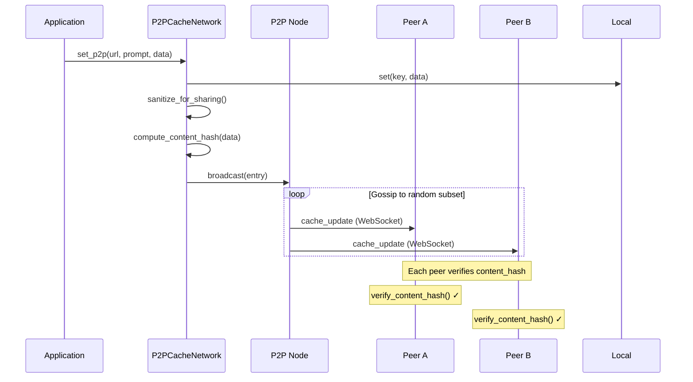
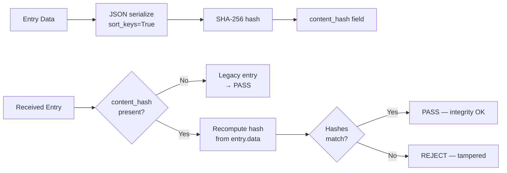
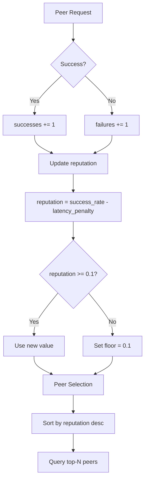
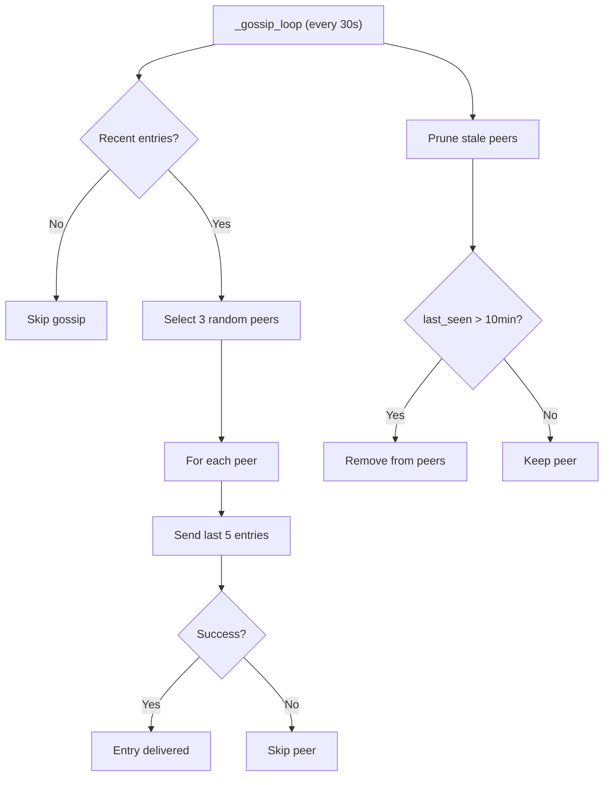
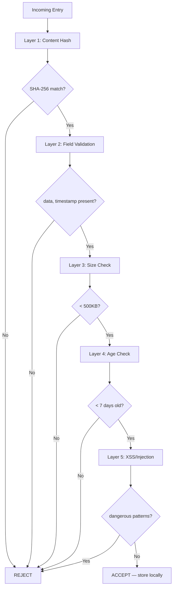

# Harvest P2P — Design Document

## Architecture Overview



## Data Flow — Cache Lookup



## Data Flow — Cache Broadcast



## Content Hash Verification



## Peer Reputation System



## Gossip Protocol



## Protocol Messages

| Message | Direction | Payload | Purpose |
|---------|-----------|---------|---------|
| `hello` | Client→Server | `{peer_id, address}` | Initial handshake |
| `hello_ack` | Server→Client | `{peer_id, address, known_peers[]}` | Accept + share peers |
| `cache_lookup` | Client→Server | `{key}` | Request cache entry |
| `cache_response` | Server→Client | `{key, data, peer_id}` | Return cached data |
| `cache_update` | Broadcast | `{entry, source}` | Share new entry |
| `ping` | Either | `{}` | Keep-alive |
| `pong` | Either | `{}` | Keep-alive response |

## Security Layers



## File Structure

```
harvest/p2p/
├── __init__.py          # Module exports
├── node.py              # P2PNode, PeerInfo, P2PConfig
├── error_handler.py     # Error tracking + auto-disable
└── bootstrap_server.py  # Bootstrap/discovery logic

harvest/
├── p2p_network.py       # P2PCacheNetwork (high-level API)
└── cache.py             # ResponseCache (local cache)
```

## Configuration Reference

```python
P2PConfig(
    enabled=False,           # Opt-in (default off for security)
    host="0.0.0.0",         # Listen address
    port=8765,              # Start port (tries 8765-8774)
    bootstrap_peers=[...],  # Bootstrap server URLs
    share_data=True,        # Share data with peers
    max_share_size_kb=500,  # Max entry size
    max_peers_to_query=5,   # Fan-out for lookups
    lookup_timeout_sec=5.0, # Per-peer timeout
    gossip_interval_sec=30, # Proactive gossip interval
    discovery_interval_sec=60,  # Reconnect interval
    min_peer_reputation=0.3,    # Min reputation threshold
)
```

## Roadmap

| Phase | Feature | Status |
|-------|---------|--------|
| Phase 0 | Basic P2P node + gossip | ✅ Done |
| Phase 1 | Content hash + reputation | ✅ Done |
| Phase 2 | DHT (distributed hash table) | 🔜 Next |
| Phase 3 | NAT traversal (hole punching) | 📋 Planned |
| Phase 4 | End-to-end encryption | 📋 Planned |
| Phase 5 | Mobile node support | 📋 Planned |

---

**Join the network. Share your cache. Build collective intelligence.**
